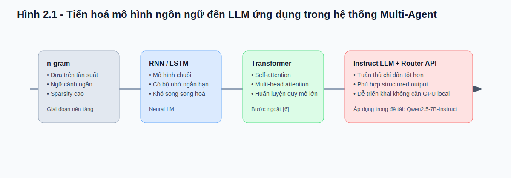
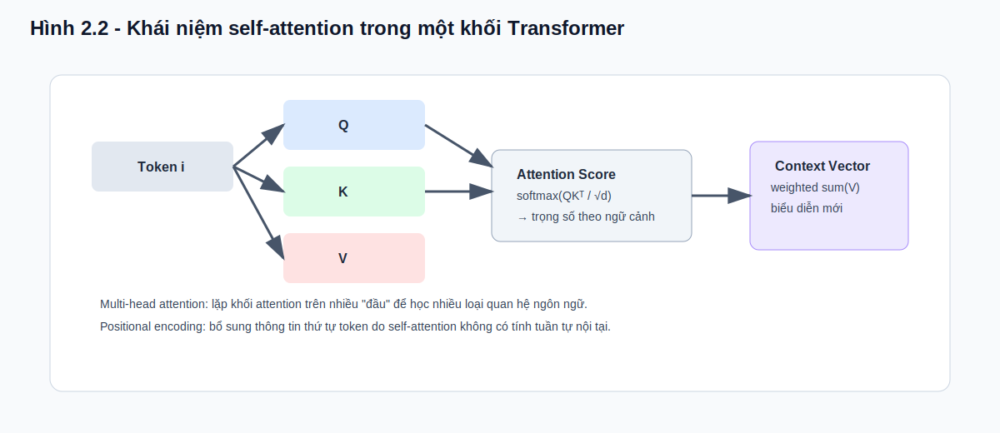
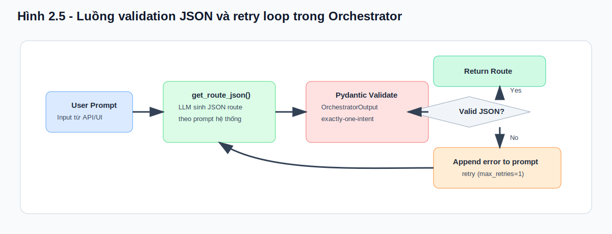
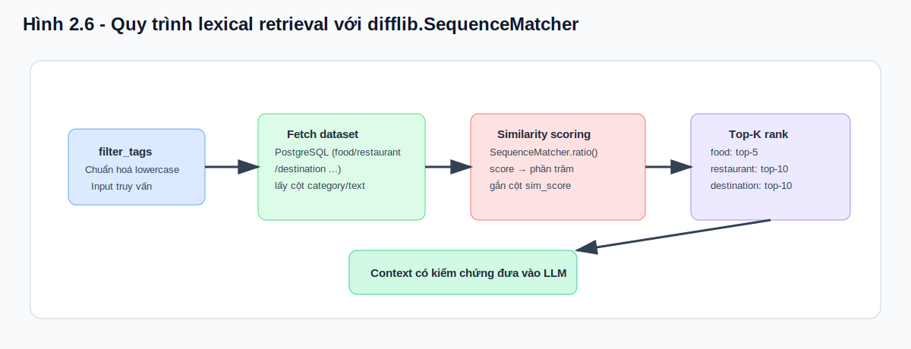
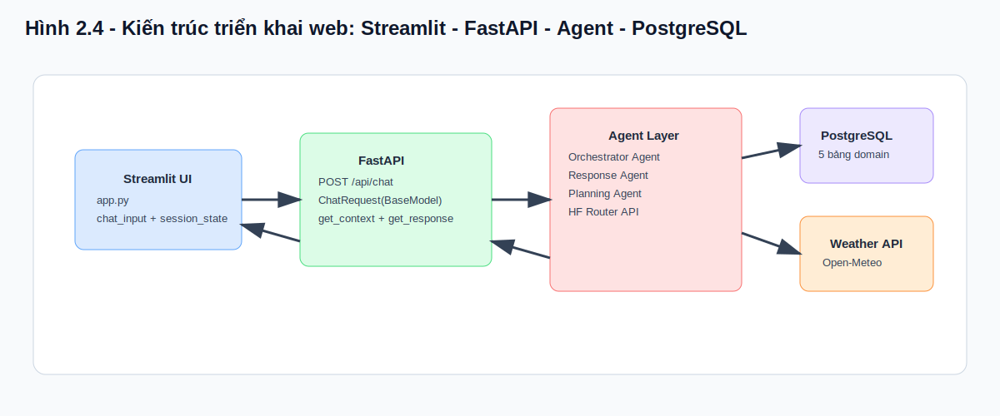

# CHƯƠNG 2

# CƠ SỞ LÝ THUYẾT

## Mục tiêu chương

Chương 2 trình bày hệ thống cơ sở lý thuyết làm nền cho toàn bộ thiết kế và triển khai của đề tài **Hệ thống trợ lý du lịch ảo Quy Nhơn sử dụng kiến trúc Multi-Agent và mô hình ngôn ngữ lớn**. Không chỉ dừng ở việc tổng quan khái niệm, chương này tập trung phân tích mối liên hệ trực tiếp giữa lý thuyết và hiện thực mã nguồn trong dự án, từ đó tạo nền tảng cho Chương 3 (phân tích, thiết kế) và Chương 4 (triển khai, kiểm thử).

Cụ thể, chương trả lời bốn câu hỏi cốt lõi:

1. Vì sao mô hình ngôn ngữ lớn (LLM) và Transformer phù hợp cho bài toán hội thoại du lịch?
2. Vì sao đề tài chọn cách tích hợp mô hình qua OpenAI-compatible API và HuggingFace Router thay vì tự host mô hình?
3. Vì sao kiến trúc Multi-Agent + Orchestrator Pattern giúp tăng tính ổn định so với chatbot một khối?
4. Vì sao đề tài ưu tiên dữ liệu có kiểm chứng (tool/database/API) kết hợp đầu ra JSON có schema thay vì sinh phản hồi tự do?

Từ các câu hỏi trên, nội dung chương được tổ chức thành sáu phần chính tương ứng với mục lục đã công bố: (i) LLM, (ii) OpenAI-compatible API & HF Router, (iii) Multi-Agent và Orchestrator Pattern, (iv) Pydantic v2, (v) truy xuất lexical bằng `difflib.SequenceMatcher`, và (vi) cơ sở dữ liệu cùng kiến trúc web triển khai.

---

## 2.1 Mô hình ngôn ngữ lớn (LLM)

### 2.1.1 Tổng quan LLM và tiến hoá từ n-gram → Transformer

Mô hình ngôn ngữ có thể được mô tả là hàm ước lượng xác suất chuỗi token:

\[
P(w_1, w_2, ..., w_n) = \prod_{t=1}^{n} P(w_t \mid w_{<t})
\]

Với các phương pháp cổ điển dựa trên n-gram, mô hình chỉ quan sát một cửa sổ ngữ cảnh ngắn cố định. Cách tiếp cận này dễ triển khai nhưng bộc lộ ba điểm yếu lớn khi áp dụng vào hội thoại tự nhiên:

* **Sparsity**: số tổ hợp token tăng rất nhanh, dữ liệu quan sát bị thưa.
* **Ngữ cảnh ngắn**: khó nắm bắt phụ thuộc dài hạn trong câu hỏi phức hợp.
* **Khả năng tổng quát thấp**: dễ lỗi khi người dùng diễn đạt đa dạng.

Sự chuyển dịch sang mô hình neural như RNN/LSTM cải thiện biểu diễn ngữ cảnh theo chuỗi thời gian, nhưng quá trình huấn luyện/suy luận tuần tự gây hạn chế song song hóa và vẫn chưa giải quyết triệt để phụ thuộc dài hạn. Bước ngoặt đến từ Transformer [6], với cơ chế self-attention cho phép mỗi token tương tác trực tiếp với toàn bộ chuỗi, qua đó nâng đáng kể năng lực biểu diễn ngữ nghĩa.

Khi quy mô dữ liệu huấn luyện và số tham số tăng mạnh, các LLM thể hiện năng lực nổi trội trong hiểu ngôn ngữ, suy luận theo ngữ cảnh và tuân thủ chỉ dẫn [2], [33], [35]. Đây là nền tảng để xây dựng các trợ lý hội thoại thông minh cho miền ứng dụng thực tế như du lịch địa phương.

### 2.1.2 Transformer: self-attention, multi-head attention, positional encoding

Transformer sử dụng phép attention để tính trọng số tương quan giữa token hiện tại và các token còn lại trong chuỗi. Ở mức toán học, một đầu attention được tính như sau [6]:

\[
\text{Attention}(Q,K,V) = \text{softmax}\left(\frac{QK^T}{\sqrt{d_k}}\right)V
\]

Trong đó:

* **Q (Query)** biểu diễn truy vấn của token hiện tại.
* **K (Key)** biểu diễn “khóa” của các token tham chiếu.
* **V (Value)** là nội dung thông tin thực tế được tổng hợp.

Cơ chế này đặc biệt quan trọng cho bài toán trợ lý du lịch, vì truy vấn người dùng thường chứa nhiều ràng buộc đồng thời (địa điểm, chi phí, thời gian, sở thích). Attention giúp mô hình phân bổ mức quan tâm khác nhau lên từng thành phần của câu hỏi, từ đó tạo phản hồi mạch lạc hơn.

**Multi-head attention** mở rộng ý tưởng trên bằng cách dùng nhiều đầu attention song song, cho phép mô hình học nhiều kiểu quan hệ khác nhau (từ đồng nghĩa, quan hệ chủ-vị, chỉ định địa danh, v.v.).

**Positional encoding** được thêm vào embedding để bảo toàn thông tin thứ tự token, vì self-attention thuần túy không có tính tuần tự nội tại.

### 2.1.3 Instruct-tuned model và ý nghĩa trong tác vụ sinh JSON

Trong bối cảnh hệ thống đa tác tử, đầu ra của LLM không chỉ là “văn bản trả lời” mà còn đóng vai trò “lệnh điều phối”. Vì vậy, mô hình cần khả năng tuân thủ định dạng nghiêm ngặt (ví dụ JSON hợp lệ, đúng khóa, đúng kiểu dữ liệu).

Các nghiên cứu về instruction tuning và RLHF cho thấy mô hình sau tinh chỉnh chỉ dẫn có xu hướng:

* Bám sát yêu cầu đầu ra tốt hơn.
* Giảm sinh nội dung ngoài phạm vi nhiệm vụ.
* Cải thiện độ nhất quán trong tác vụ structured output [36].

Điều này giải thích tại sao đề tài ưu tiên mô hình dạng Instruct cho Orchestrator Agent. Với pipeline route → retrieve → inject → generate, đầu ra JSON hợp lệ là điều kiện tiên quyết để hệ thống vận hành ổn định ở các bước sau.

### 2.1.4 Mô hình sử dụng thực tế: `Qwen/Qwen2.5-7B-Instruct:together`

Trong mã nguồn hiện tại, cả ba agent đều sử dụng model `Qwen/Qwen2.5-7B-Instruct:together` thông qua chuẩn API tương thích OpenAI. Lý do lựa chọn có thể tóm tắt ở ba góc độ:

* **Chất lượng phản hồi**: phù hợp tác vụ hội thoại tiếng Việt và định dạng có cấu trúc.
* **Chi phí triển khai**: không bắt buộc tự host hạ tầng GPU nội bộ.
* **Tính đồng nhất kỹ thuật**: một client pattern dùng chung cho toàn bộ agents, giảm rủi ro phân mảnh logic.

Bảng 2.1 trình bày đối chiếu ngắn gọn giữa yêu cầu hệ thống và khả năng của mô hình được chọn.

**Bảng 2.1 - Đối chiếu tiêu chí lựa chọn mô hình cho đề tài**

| Tiêu chí | Yêu cầu của đề tài | Ý nghĩa trong triển khai |
|---|---|---|
| Tuân thủ định dạng | Cần sinh JSON đúng schema | Tránh lỗi parse/routing ở Orchestrator |
| Khả năng hội thoại | Phản hồi tự nhiên cho domain du lịch | Cải thiện trải nghiệm người dùng |
| Dễ tích hợp API | OpenAI-compatible interface | Dùng chung mẫu code cho 3 agents |
| Chi phí vận hành | Không phụ thuộc GPU local | Phù hợp môi trường nghiên cứu |

---

## 2.2 OpenAI-compatible API và HuggingFace Router

### 2.2.1 Kiến trúc Router và lợi ích không cần GPU cục bộ

Về mặt kiến trúc hệ thống, việc tách lớp ứng dụng ra khỏi lớp suy luận mô hình là một nguyên tắc quan trọng để giảm độ phức tạp vận hành. HuggingFace Router cho phép truy cập mô hình qua endpoint chuẩn hóa, giúp nhóm phát triển tập trung vào luồng nghiệp vụ thay vì quản trị hạ tầng inference.

Lợi ích chính trong bối cảnh đề tài:

* Rút ngắn thời gian triển khai proof-of-practice.
* Tránh gánh nặng vận hành máy chủ GPU.
* Dễ thay đổi model backend khi cần đánh giá so sánh.

### 2.2.2 `openai.OpenAI` với `base_url` custom

Trong các file agent, client được khởi tạo theo dạng:

* `OpenAI(base_url="https://router.huggingface.co/v1", api_key=HF_TOKEN)`.

Thiết kế này tạo ra hai ưu điểm kỹ thuật:

1. **Giảm coupling**: logic gọi API giữ nguyên ngay cả khi thay đổi backend model.
2. **Tăng khả năng bảo trì**: cùng một mẫu gọi `chat.completions.create(...)` cho Orchestrator, Response và Planning.

Từ góc nhìn kỹ nghệ phần mềm, đây là một dạng chuẩn hóa interface tích cực, giúp code dễ đọc, dễ kiểm thử và dễ mở rộng [7], [18].

### 2.2.3 Quản lý `HF_TOKEN` bằng `python-dotenv`

Thông tin bí mật được tách khỏi source code thông qua biến môi trường và nạp bằng `load_dotenv()`. Cách làm này tuân thủ nguyên tắc quản trị cấu hình ứng dụng hiện đại:

* Không hard-code credentials trong mã nguồn.
* Dễ tách môi trường dev/test/production.
* Giảm rủi ro rò rỉ khóa truy cập qua hệ thống quản lý phiên bản.

Bảng 2.2 tổng kết vai trò của từng thành phần trong lớp truy cập mô hình.

**Bảng 2.2 - Thành phần lớp tích hợp mô hình và vai trò**

| Thành phần | Vai trò | Lợi ích |
|---|---|---|
| `openai.OpenAI` client | Giao tiếp với endpoint model | API nhất quán giữa các agent |
| `base_url` custom | Trỏ đến HF Router | Không cần host local inference |
| `HF_TOKEN` | Xác thực truy cập | Bảo mật và phân tách cấu hình |
| `python-dotenv` | Nạp biến môi trường | Dễ cấu hình theo môi trường chạy |

---

## 2.3 Kiến trúc Multi-Agent và Orchestrator Pattern

### 2.3.1 Khái niệm Agent và Multi-Agent System

Trong văn liệu MAS, agent được xem là thực thể phần mềm có tính tự trị cục bộ, nhận đầu vào, ra quyết định và tạo hành động phù hợp trong phạm vi nhiệm vụ. Multi-Agent System là tập hợp nhiều agent phối hợp giải bài toán lớn theo nguyên tắc phân rã chức năng [19], [38].

So với kiến trúc đơn tác tử, MAS có các ưu điểm đáng kể trong bài toán trợ lý du lịch:

* Chuyên môn hóa theo nhiệm vụ (điều phối, phản hồi, lập lịch).
* Dễ mở rộng theo miền dữ liệu mới.
* Giảm nhiễu ngữ cảnh khi mỗi agent xử lý phạm vi rõ ràng.

### 2.3.2 Tách vai trò: Orchestrator / Response / Planning

Kiến trúc hiện tại của dự án triển khai ba tác tử chính:

* **Orchestrator Agent**: phân loại intent và phát JSON route.
* **Response Agent**: sinh câu trả lời cho truy vấn thông tin thường gặp.
* **Planning Agent**: sinh kế hoạch hành trình nhiều ngày theo ràng buộc đầu vào.

Mô hình này tương thích với các nghiên cứu gần đây về hệ ứng dụng LLM đa tác tử: tách nhiệm vụ điều phối khỏi nhiệm vụ sinh nội dung giúp tăng độ kiểm soát và tính ổn định của hệ thống [15], [24].

### 2.3.3 Intent classification trong NLP

Intent classification là bước cầu nối giữa ngôn ngữ tự nhiên của người dùng và logic nghiệp vụ máy. Sai lệch ở bước này sẽ kéo theo sai lệch toàn chuỗi xử lý phía sau. Vì vậy, trong đề tài, intent classification không chỉ là chức năng NLP, mà còn là cơ chế điều phối tài nguyên truy xuất dữ liệu và chọn agent sinh đáp án.

Trong thực tiễn, câu hỏi du lịch có thể mơ hồ hoặc chứa nhiều ý định. Do đó, ràng buộc “exactly-one-intent” ở tầng schema là quyết định kỹ thuật quan trọng để ép hệ thống giữ tính đơn trị trong từng lượt tương tác.

### 2.3.4 8 intents thực tế trong hệ thống

Hệ thống hiện vận hành với tám intents cấp cao:

1. `food`
2. `restaurant`
3. `destination`
4. `planning`
5. `weather`
6. `hotel`
7. `service`
8. `chat`

Mỗi intent ánh xạ tới một schema con và luồng xử lý chuyên biệt ở backend. Cách tổ chức này giúp đảm bảo traceability rõ ràng giữa mô tả tài liệu và mã nguồn triển khai.

### 2.3.5 Routing bằng JSON có cấu trúc

JSON routing mang lại bốn lợi ích kỹ thuật cốt lõi:

* **Khả năng phân tích máy**: parse trực tiếp không cần NLP hậu xử lý.
* **Kiểm thử tự động**: so khớp schema trong unit/integration checks.
* **Ghi log có cấu trúc**: hỗ trợ truy vết và chẩn đoán lỗi.
* **Giảm mơ hồ**: tránh trường hợp model trả lời dài nhưng thiếu tín hiệu điều phối.

Bảng 2.3 tổng hợp vai trò của từng lớp trong pipeline Multi-Agent.

**Bảng 2.3 - Vai trò các lớp trong pipeline điều phối**

| Lớp | Đầu vào | Đầu ra | Trách nhiệm |
|---|---|---|---|
| Orchestrator | User prompt | JSON route | Chọn intent + tham số |
| Validator | JSON route | JSON hợp lệ / lỗi | Bảo đảm đúng schema |
| Tool Layer | Tham số intent | Context có kiểm chứng | Truy xuất DB/API |
| Response/Planning | Prompt + context | Phản hồi cuối | Sinh nội dung cho người dùng |

---

## 2.4 Pydantic v2 và xác thực dữ liệu có cấu trúc

### 2.4.1 Schema-first validation với `BaseModel`, `Literal`, `Optional`

Pydantic v2 cho phép khai báo schema Pythonic nhưng có tính cưỡng chế kiểu dữ liệu cao khi chạy thực tế. Trong hệ thống, schema-first có vai trò như “hợp đồng dữ liệu” giữa Orchestrator và các thành phần phía sau.

Việc dùng:

* `BaseModel` để định nghĩa cấu trúc,
* `Literal` để khóa miền giá trị hợp lệ,
* `Optional` cho tham số có thể thiếu,

đã giúp pipeline duy trì tính ổn định khi tương tác với đầu ra xác suất từ LLM.

### 2.4.2 9 models trong Orchestrator (`8 leaf + 1 root`)

Cấu trúc hiện tại gồm 8 model lá (mỗi intent một model) và 1 model gốc `OrchestratorOutput`. Cách tổ chức này mang lại:

* Khả năng mở rộng rõ ràng khi thêm intent mới.
* Dễ unit-test từng intent độc lập.
* Dễ mapping giữa tài liệu nghiệp vụ và lớp mã nguồn.

### 2.4.3 `model_post_init` cho ràng buộc exactly-one-intent

Trong `model_post_init`, hệ thống đếm số trường top-level khác `None`; nếu khác 1 thì ném lỗi. Đây là cơ chế cưỡng chế rất quan trọng:

* Ngăn trường hợp một prompt bị route thành nhiều intent cạnh tranh.
* Ngăn trường hợp không có intent (pipeline bị mù điều phối).
* Tăng tính quyết định cho luồng xử lý API.

### 2.4.4 `ValidationError` feedback loop và `max_retries=1`

Khi validate thất bại, lỗi schema được đưa ngược vào prompt như phản hồi hiệu chỉnh để yêu cầu mô hình sinh lại JSON chuẩn. Đây là “feedback loop” tối thiểu nhưng hiệu quả cho bối cảnh thực nghiệm.

Do cấu hình hiện tại đặt `max_retries=1`, hệ thống ưu tiên thời gian phản hồi hơn số vòng tự phục hồi. Nhược điểm là chưa mạnh trong các trường hợp mô hình lỗi liên tiếp; ưu điểm là giữ độ trễ ở mức chấp nhận được cho trải nghiệm tương tác.

Bảng 2.4 minh hoạ một số kiểu lỗi phổ biến và cách hệ thống phản ứng.

**Bảng 2.4 - Lỗi structured output và cơ chế xử lý**

| Loại lỗi | Ví dụ | Cơ chế xử lý |
|---|---|---|
| Sai JSON | Thiếu dấu ngoặc/nháy | `ValidationError` + retry |
| Sai intent count | Có 2 khóa top-level | `model_post_init` từ chối |
| Sai kiểu dữ liệu | `max_price` là text không hợp lệ | Validation bắt lỗi kiểu |
| Thiếu trường bắt buộc | `weather` thiếu `location` | Validation trả lỗi chi tiết |

---

## 2.5 Truy xuất tương đồng văn bản với `difflib.SequenceMatcher`

### 2.5.1 Nguyên lý lexical similarity và `.ratio()`

`difflib.SequenceMatcher` đo độ tương đồng dựa trên mức trùng khớp chuỗi, trả về điểm trong khoảng \([0,1]\). Trong dự án, điểm này được quy đổi phần trăm để xếp hạng kết quả tra cứu.

Về bản chất, đây là **lexical retrieval** (so khớp bề mặt chuỗi), có các ưu điểm:

* Nhẹ và nhanh.
* Không yêu cầu vector index.
* Dễ giải thích kết quả cho kiểm thử.

Hạn chế: chưa nắm bắt đầy đủ quan hệ đồng nghĩa/ngữ nghĩa sâu như embedding-based retrieval [8], [20].

### 2.5.2 Chiến lược `filter_tags`

Các tool hiện chuẩn hóa truy vấn người dùng bằng `filter_tags`, đưa về chữ thường rồi so khớp với trường danh mục (`category`) hoặc trường mô tả tương quan trong bảng dữ liệu. Chiến lược này phù hợp với dữ liệu địa phương đã được chuẩn hoá nhãn ở mức cơ bản.

### 2.5.3 Top-K retrieval: food top-5, restaurant top-10, destination top-10

Sau khi tính điểm tương đồng, các tool lấy Top-K kết quả:

* Food: top-5.
* Restaurant: top-10.
* Destination: top-10.

Mục tiêu là cân bằng giữa:

* độ bao phủ thông tin trong context,
* chi phí token khi đưa vào prompt cho LLM,
* và độ liên quan của kết quả trả về.

Bảng 2.5 so sánh nhanh lexical retrieval hiện tại và semantic retrieval định hướng tương lai.

**Bảng 2.5 - So sánh lexical retrieval và semantic retrieval**

| Tiêu chí | Lexical (`difflib`) | Semantic (embedding/RAG) |
|---|---|---|
| Chi phí triển khai | Thấp | Trung bình đến cao |
| Hạ tầng | Không cần vector DB | Cần index/vector store |
| Độ chính xác ngữ nghĩa | Trung bình | Cao hơn ở truy vấn biến thể |
| Khả năng giải thích | Dễ | Khó hơn |
| Phù hợp giai đoạn | Prototype/PoC | Mở rộng production |

---

## 2.6 Cơ sở dữ liệu và kiến trúc web

### 2.6.1 PostgreSQL + SQLAlchemy + Pandas pipeline

Hệ thống sử dụng PostgreSQL làm kho dữ liệu quan hệ trung tâm với năm bảng miền cốt lõi: `food`, `restaurant`, `destination`, `hotel`, `service`. Lựa chọn mô hình quan hệ phù hợp với dữ liệu du lịch có cấu trúc rõ (tên, mô tả, địa chỉ, phân loại, mức giá) [25], [26].

SQLAlchemy đóng vai trò lớp kết nối/khởi tạo truy vấn, trong khi Pandas phục vụ thao tác dữ liệu theo lô và hậu xử lý kết quả trước khi trả về context cho LLM.

Tổ hợp này có lợi thế thực tiễn:

* Maturity cao trong hệ sinh thái Python.
* Dễ truy vấn và mở rộng schema.
* Dễ kiểm soát chất lượng dữ liệu trước khi đưa vào pipeline AI.

### 2.6.2 FastAPI (`/api/chat`) + Streamlit client-server architecture

Hệ thống triển khai theo mô hình client-server tối giản:

* **Frontend**: Streamlit (`app.py`) xử lý giao diện chat và session state.
* **Backend**: FastAPI (`main.py`) cung cấp endpoint `/api/chat` để điều phối toàn pipeline.

Luồng chuẩn:

1. Người dùng gửi prompt từ Streamlit.
2. Backend nhận request, kiểm tra dữ liệu vào.
3. Orchestrator route intent bằng JSON.
4. Tool Layer truy xuất dữ liệu kiểm chứng.
5. Response/Planning Agent sinh đáp án cuối.
6. Kết quả trả ngược về giao diện.

Thiết kế này tách biệt giao diện khỏi nghiệp vụ, tạo điều kiện thuận lợi cho kiểm thử và thay thế thành phần độc lập.

### 2.6.3 Request validation với `ChatRequest(BaseModel)`

Ở biên API, request được kiểm tra qua `ChatRequest(BaseModel)` nhằm:

* chặn payload không hợp lệ ngay từ đầu,
* giảm lan truyền lỗi vào tầng agent/tool,
* chuẩn hoá contract giữa frontend và backend.

Về phương diện chất lượng phần mềm, đây là bước phòng thủ quan trọng theo hướng thiết kế hệ thống tin cậy và dễ bảo trì [10], [27].

---

### 2.6.4 Tổng hợp liên hệ giữa cơ sở lý thuyết và hiện trạng mã nguồn

Để đảm bảo tính truy vết (traceability), Bảng 2.6 ánh xạ trực tiếp từng nhóm lý thuyết với thành phần đã triển khai trong repository.

**Bảng 2.6 - Ánh xạ lý thuyết ↔ triển khai trong dự án**

| Nhóm lý thuyết | Thành phần triển khai | Ý nghĩa thực thi |
|---|---|---|
| LLM Instruct | `agents/*.py` gọi model Qwen2.5 | Sinh phản hồi + JSON định tuyến |
| Structured output | `Orchestrator_Agent.py` + Pydantic | Bảo đảm đầu ra parse được |
| Multi-Agent | Orchestrator/Response/Planning | Tách vai trò chuyên biệt |
| Lexical retrieval | `tools/get_*.py` với `difflib` | Lọc và xếp hạng dữ liệu địa phương |
| Data layer | PostgreSQL + SQLAlchemy + Pandas | Nguồn tri thức kiểm chứng |
| Service layer | `main.py` (FastAPI) | Điều phối pipeline API |
| Presentation layer | `app.py` (Streamlit) | Trải nghiệm hội thoại người dùng |

Bảng 2.6 cho thấy các khái niệm lý thuyết trong chương không tách rời triển khai thực tế mà đã được hiện thực thành các module cụ thể, có thể kiểm chứng trực tiếp trong mã nguồn.

---

## 2.7 Tóm tắt chương

Chương 2 đã trình bày đầy đủ nền tảng lý thuyết của đề tài theo định hướng “lý thuyết gắn với triển khai”. Các nội dung trọng tâm bao gồm:

* Cơ sở của LLM và Transformer, cùng vai trò của Instruct tuning trong tác vụ sinh structured output.
* Lý do lựa chọn lớp tích hợp mô hình qua OpenAI-compatible API và HuggingFace Router để tối ưu khả năng triển khai.
* Ưu điểm của kiến trúc Multi-Agent kết hợp Orchestrator pattern trong phân rã trách nhiệm và tăng độ kiểm soát pipeline.
* Vai trò của Pydantic v2 trong cưỡng chế schema JSON và cơ chế retry khi xảy ra lỗi định dạng.
* Bản chất lexical retrieval của `difflib.SequenceMatcher`, ưu/nhược điểm và vị trí của nó trong giai đoạn prototype.
* Nền tảng dữ liệu và kiến trúc web (PostgreSQL, FastAPI, Streamlit) tạo thành hệ thống vận hành end-to-end.

Từ nền tảng này, Chương 3 sẽ tiếp tục đi sâu vào phân tích yêu cầu, thiết kế chi tiết kiến trúc và đặc tả pipeline xử lý của từng use case trong hệ thống.
