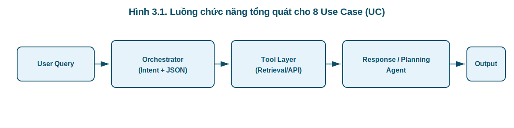
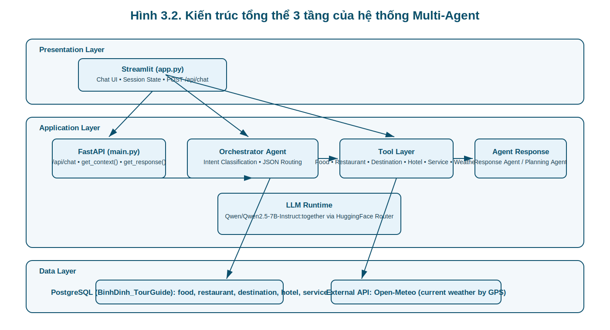

# CHƯƠNG 3: PHÂN TÍCH VÀ THIẾT KẾ HỆ THỐNG ĐA TÁC NHÂN

Chương này đóng vai trò là cầu nối giữa các cơ sở lý thuyết đã trình bày ở Chương 2 và quá trình lập trình thực tế sẽ được thảo luận ở Chương 4. Nội dung của chương tập trung vào việc áp dụng các nguyên lý kỹ thuật phần mềm (Software Engineering) để phân tích yêu cầu, từ đó thiết kế kiến trúc hệ thống, quy hoạch cơ sở dữ liệu, và đặc biệt là thiết kế cấu trúc tác nhân (Agent) thông qua kỹ thuật Prompt Engineering và Pydantic Validation.

---

## 3.1 Đặc tả yêu cầu hệ thống

Phân tích yêu cầu là bước khởi đầu và mang tính quyết định trong vòng đời phát triển phần mềm (Software Development Life Cycle – SDLC). Theo Sommerville [7], mục tiêu cốt lõi của giai đoạn này là xác định một cách chính xác và không mơ hồ những gì hệ thống phải thực hiện (Functional Requirements) cũng như các tiêu chuẩn chất lượng mà hệ thống phải đáp ứng (Non-functional Requirements).

Đối với hệ thống **Trợ lý Du lịch Ảo Quy Nhơn – Bình Định**, yêu cầu được phân chia thành hai nhóm chính:

* **Yêu cầu chức năng (Functional Requirements)** – mô tả các Use Case (UC) cụ thể mà hệ thống phải thực hiện.
* **Yêu cầu phi chức năng (Non-functional Requirements)** – mô tả các ràng buộc về hiệu năng, độ ổn định, tính xác định và khả năng mở rộng của kiến trúc đa tác tử.

Hệ thống được thiết kế theo kiến trúc Multi-Agent, trong đó Orchestrator Agent chịu trách nhiệm định tuyến (routing) và xuất JSON có cấu trúc — một yêu cầu quan trọng đối với các hệ thống sử dụng LLM hiện đại [9].

---

# 3.1.1 Yêu cầu chức năng

Hệ thống phải xử lý chính xác **8 Use Case (UC)** tương ứng với 8 intent được định nghĩa trong schema của Orchestrator Agent.



---

## UC-01: Tra cứu món ăn theo loại và sở thích (Food Intent)

**Mục tiêu:**
Cung cấp danh sách tối đa 5 món ăn phù hợp với loại món và sở thích người dùng.

**Tham số bắt buộc trích xuất:**

* `type_of_food`: chỉ được thuộc tập giá trị chuẩn hóa gồm:
  `"món chính"`, `"món phụ"`, `"đồ ăn vặt"`, `"đồ tráng miệng"`, `"đồ uống"`.
* `filter_tags`: chuỗi từ khóa mô tả sở thích (không bao gồm tên tỉnh/thành).

**Luồng xử lý kỹ thuật:**

1. Orchestrator Agent phân loại intent `food`.
2. Xuất JSON hợp lệ dạng:

   ```json
   {"food": {"type_of_food": "...", "filter_tags": "..."}}
   ```
3. Tool Layer gọi `get_food_list(type_of_food, filter_tags)`.
4. Truy vấn bảng `food` bằng câu lệnh SQL có tham số hóa (parameterized query) nhằm ngăn chặn SQL Injection.
5. Tính điểm tương đồng bằng `difflib.SequenceMatcher`.
6. Trả về **Top-5** bản ghi có similarity score cao nhất.

Việc sử dụng truy vấn có tham số và kiểm soát dữ liệu đầu vào tuân theo nguyên lý thiết kế phần mềm an toàn được khuyến nghị trong kỹ nghệ phần mềm hiện đại [7].

---

## UC-02: Tra cứu nhà hàng theo phong cách (Restaurant Intent)

**Tham số trích xuất:**

* `filter_tags` (ví dụ: “quán nhậu bình dân”, “ăn chay”, “kiểu Pháp”).

**Luồng xử lý:**

1. Orchestrator → intent `restaurant`.
2. Tool `get_restaurant(filter_tags)` truy vấn toàn bộ bảng `restaurant`.
3. So khớp chuỗi giữa `filter_tags` và trường `category`.
4. Trả về **Top-10** nhà hàng có điểm tương đồng cao nhất.

Cách tiếp cận này phù hợp với các hệ thống truy vấn dựa trên từ khóa có cấu trúc dữ liệu rõ ràng [7].

---

## UC-03: Tra cứu địa điểm tham quan theo loại hình (Destination Intent)

**Tham số trích xuất:**

* `filter_tags` (ví dụ: “bãi biển”, “di tích lịch sử”, “khu vui chơi”).

**Luồng xử lý:**

1. Orchestrator → intent `destination`.
2. Gọi `get_destination(filter_tags)`.
3. Truy vấn bảng `destination`.
4. Tính similarity score dựa trên trường `category`.
5. Trả về **Top-10** địa điểm kèm:

   * địa chỉ
   * mô tả
   * `gps_lat`, `gps_lon`

Dữ liệu GPS là tiền đề bắt buộc cho UC-05 (Weather).

---

## UC-04: Lập lịch trình du lịch (Planning Intent)

Đây là Use Case phức tạp nhất và yêu cầu phối hợp nhiều Agent.

**Tham số trích xuất:**

* `time` (mặc định: “3 ngày”)
* `budget` (mặc định: “5 triệu”)
* `prefer` (mặc định: “hải sản, biển”)

**Luồng xử lý kỹ thuật:**

1. Orchestrator xuất JSON dạng:

   ```json
   {"planning": {"time": "...", "budget": "...", "prefer": "..."}}
   ```
2. Kích hoạt `planning_flag = True`.
3. Gọi đồng thời:

   * `get_destination(prefer)`
   * `get_restaurant(prefer)`
   * `get_hotel(prefer)`
   * `get_food_list(...)`
4. Tổng hợp thành một structured context.
5. Chuyển sang Planning Agent.

Planning Agent bắt buộc sinh lịch trình có cấu trúc rõ ràng gồm:

* Mở đầu
* Lịch trình theo ngày/buổi
* Bảng ngân sách tham khảo
* Kết luận

Theo nghiên cứu về Retrieval-Augmented Generation (RAG), việc ép LLM sinh nội dung dựa hoàn toàn trên context đã truy xuất giúp giảm hallucination đáng kể [8].

---

## UC-05: Hỏi thời tiết tại địa điểm cụ thể (Weather Intent)

**Tham số trích xuất:**

* `location` (giữ nguyên dấu, không suy diễn).

**Luồng xử lý hai bước:**

1. Truy vấn bảng `destination` để lấy `gps_lat`, `gps_lon`.
2. Gọi API Open-Meteo:

   ```
   https://api.open-meteo.com/v1/forecast?latitude=...&longitude=...&current_weather=true
   ```

Hệ thống chỉ bổ sung dữ liệu thời tiết vào context, không cho phép LLM tự suy đoán thông tin ngoài dữ liệu API — nguyên tắc kiểm soát tri thức ngoại vi trong hệ thống LLM kết hợp công cụ [8].

---

## UC-06: Tìm khách sạn theo vị trí và mức giá (Hotel Intent)

**Tham số:**

* `location`
* `max_price` (chuẩn hóa về số nguyên VNĐ).

**Luồng xử lý:**

1. Chuyển đổi chuỗi giá sang `price_numeric`.
2. Lọc theo điều kiện `price_numeric <= max_price`.
3. Nếu rỗng → kích hoạt **nearest-price fallback**:

   ```
   ORDER BY ABS(price_numeric - max_price)
   ```
4. Trả về **Top-5** sắp xếp tăng dần theo giá.

---

## UC-07: Tra cứu dịch vụ tại điểm du lịch (Service Intent)

**Tham số:**

* `location` (bắt buộc)
* `filter_tags` (tùy chọn)

**Luồng xử lý hai giai đoạn:**

1. Tìm `destination_id`.
2. Truy vấn bảng `service` theo ID.
3. Nếu có `filter_tags` → áp dụng điều kiện `ILIKE`.
4. Nếu không tìm thấy địa điểm → trả trạng thái `"not_found"`.

---

## UC-08: Hội thoại chung (Chat Intent)

Intent `chat` được xử lý trực tiếp bởi Response Agent mà không gọi Tool Layer.

JSON bắt buộc:

```json
{"chat": {}}
```

Không được chứa free-text ngoài JSON — yêu cầu này dựa trên nguyên tắc ép LLM sinh structured output nhằm bảo đảm tính xác định [9].

---


# 3.1.2 Yêu cầu phi chức năng

Theo tiêu chuẩn ISO/IEC 25010 [10], các yêu cầu phi chức năng mô tả các thuộc tính chất lượng mà hệ thống phải đảm bảo bên cạnh tính đúng đắn chức năng.

---

**Thời gian phản hồi (Latency / Performance Efficiency).**

Do LLM sinh văn bản theo cơ chế tự hồi quy (auto-regressive generation), mỗi token được tạo ra tuần tự theo phân phối xác suất:

[
P(w_t \mid w_{<t})
]

Quá trình này khiến thời gian suy luận dài hơn so với API truyền thống. Do đó, hệ thống thiết lập ngưỡng thời gian phản hồi tối đa là **60 giây** cho toàn bộ chu trình từ lúc người dùng gửi yêu cầu đến khi hiển thị kết quả trên giao diện. Giới hạn này nhằm đảm bảo trải nghiệm người dùng theo khuyến nghị về tương tác người–AI [7].

---

**Tính xác định trong phân loại ý định (Determinism & Reliability).**

LLM vốn hoạt động theo cơ chế xác suất, do đó đầu ra mang tính ngẫu nhiên (stochastic). Tuy nhiên, nghiệp vụ định tuyến của hệ thống yêu cầu tính tất định (deterministic routing). Vì vậy:

* Orchestrator Agent phải trả về đúng một đối tượng JSON hợp lệ.
* Chỉ chứa duy nhất một khóa cấp cao nhất (exactly-one-key constraint).
* Không sinh thêm văn bản tự do.

Yêu cầu này nhằm đảm bảo quy trình phân tích cú pháp (JSON parsing) không bị lỗi và toàn bộ pipeline hoạt động ổn định.

---

**Khả năng xử lý lỗi mềm mại (Graceful Degradation / Fault Tolerance).**

Trong kiến trúc phụ thuộc Cloud API, các lỗi như:

* Mất kết nối mạng,
* Vượt giới hạn API (rate limit),
* Lỗi máy chủ (HTTP 500),

là điều không thể tránh khỏi. Theo Knight [11], hệ thống phần mềm phải đảm bảo cơ chế xử lý lỗi an toàn, đặc biệt khi tích hợp thành phần bên ngoài. Do đó, hệ thống phải:

* Bắt ngoại lệ tại tầng Backend.
* Không để lộ stack-trace kỹ thuật ra giao diện người dùng.
* Trả về thông báo xin lỗi thân thiện và đề nghị thử lại.

---


### 3.1.3. Ràng buộc thiết kế (Design Constraints) 

Ràng buộc thiết kế giới hạn không gian giải pháp kỹ thuật của hệ thống và được xác định ngay từ đầu để đảm bảo tính khả thi triển khai.

---

**Ràng buộc về Hạ tầng và Triển khai.**

Hệ thống được thiết kế để hoạt động trong môi trường không có GPU chuyên dụng. Vì vậy:

* Cấm tải trực tiếp trọng số mô hình tại máy chủ cục bộ.
* Toàn bộ suy luận phải thông qua Cloud API (HuggingFace Inference Router).
* Giao tiếp sử dụng giao thức HTTP chuẩn hóa theo OpenAI-compatible API.

Ràng buộc này giúp giảm chi phí phần cứng và phù hợp với kiến trúc prediction-serving phân tán được đề xuất trong các hệ thống phục vụ mô hình học máy hiện đại [12].

---

**Ràng buộc về Không gian Dữ liệu (Data Scope Constraints).**

Để ngăn chặn hiện tượng “ảo giác” (hallucination), hệ thống bị giới hạn chặt chẽ trong phạm vi địa lý Quy Nhơn – Bình Định. Điều này đồng nghĩa:

* Chỉ được phép sử dụng dữ liệu đã lưu trữ trong cơ sở dữ liệu nội bộ.
* Nếu người dùng yêu cầu nội dung ngoài phạm vi (ví dụ: Đà Nẵng, Nha Trang, Đà Lạt), hệ thống phải từ chối thay vì tự động sinh nội dung dựa trên tri thức tổng quát của LLM.

Ràng buộc này đảm bảo tính chính xác của thông tin và duy trì tính nhất quán của hệ thống.

---


## 3.2 Thiết kế kiến trúc tổng thể

Mục này trình bày kiến trúc tổng thể của hệ thống Trợ lý Du lịch Ảo Quy Nhơn – Bình Định, bao gồm:

* Mô hình phân tầng 3 lớp (3-tier architecture).
* Luồng xử lý dữ liệu end-to-end.
* Thiết kế pipeline tách biệt giữa truy xuất và sinh văn bản.
* Cấu trúc tổ chức mã nguồn phục vụ khả năng mở rộng.

Thiết kế được xây dựng theo nguyên lý **Separation of Concerns (SoC)** và kiến trúc N-tier nhằm đảm bảo tính độc lập, khả năng mở rộng và tính kiểm chứng của hệ thống [18].

---

## 3.2.1 Sơ đồ tổng thể 3 tầng: Presentation / Application / Data

Hệ thống được tổ chức theo kiến trúc 3 tầng logic, giao tiếp thông qua HTTP RESTful API, phù hợp với mô hình kiến trúc Web hiện đại [18].



### (1) Presentation Layer

Tầng trình diễn được xây dựng bằng framework **Streamlit** (`app.py`).

Chức năng chính:

* Hiển thị giao diện hội thoại dạng chat UI.
* Quản lý trạng thái phiên (`st.session_state`) để lưu lịch sử hội thoại.
* Gửi yêu cầu đến backend thông qua HTTP POST request.

Frontend đóng vai trò Web Client, hoàn toàn không chứa logic xử lý nghiệp vụ, bảo đảm nguyên tắc tách biệt giao diện và xử lý (UI–Logic decoupling).

---

### (2) Application Layer

Tầng ứng dụng là lõi xử lý của hệ thống, triển khai trên **FastAPI** (`main.py`) và vận hành qua ASGI server `uvicorn`.

Tầng này bao gồm ba thành phần:

#### (a) Backend API

* Định nghĩa endpoint `/api/chat`.
* Điều phối pipeline xử lý truy vấn.
* Quản lý exception handling và timeout (≤ 60 giây).

FastAPI được lựa chọn do hỗ trợ asynchronous processing và hiệu năng cao trong môi trường I/O-bound.

---

#### (b) Agent Layer

Bao gồm ba tác nhân chuyên biệt:

* **Orchestrator Agent** – phân loại ý định và sinh JSON cấu trúc.
* **Response Agent** – sinh phản hồi hội thoại đơn miền.
* **Planning Agent** – sinh lịch trình đa ngày có cấu trúc.

Mô hình sử dụng: `Qwen/Qwen2.5-7B-Instruct` thông qua HuggingFace Router.

Kiến trúc này tuân theo mô hình **Multi-Agent Orchestration Pattern**, trong đó mỗi tác tử đảm nhiệm một vai trò duy nhất, giúp giảm nhiễu ngữ cảnh và tăng độ chính xác định tuyến [19].

---

#### (c) Tool Layer

Tầng công cụ thực thi các thao tác truy xuất dữ liệu thực tế:

* Truy vấn PostgreSQL thông qua SQLAlchemy.
* Tính toán độ tương đồng chuỗi bằng `difflib.SequenceMatcher`.
* Gọi API thời tiết Open-Meteo.

Tool Layer đóng vai trò trung gian giữa LLM và nguồn dữ liệu, hiện thực hóa mô hình Retrieval-Augmented Generation (RAG) [20].

---

### (3) Data Layer

Tầng dữ liệu bao gồm:

* Cơ sở dữ liệu quan hệ PostgreSQL (`BinhDinh_TourGuide`).
* 5 bảng chính: `food`, `restaurant`, `destination`, `hotel`, `service`.
* API ngoại vi: Open-Meteo (dữ liệu thời gian thực).

Thiết kế quan hệ giúp đảm bảo toàn vẹn dữ liệu (referential integrity) và hỗ trợ truy vấn có điều kiện.

---

## 3.2.2 Luồng dữ liệu: Streamlit → FastAPI → Orchestrator → Tools → Agent

Luồng xử lý dữ liệu được thiết kế tuyến tính và khép kín nhằm bảo đảm tính xác định (deterministic flow).

### Bước 1 – Nhập liệu

Người dùng nhập câu hỏi vào Streamlit.
Frontend đóng gói payload dạng:

```json
{"user_prompt": "..."}
```

và gửi đến endpoint `/api/chat`.

---

### Bước 2 – Định tuyến (Orchestrator)

FastAPI chuyển truy vấn đến Orchestrator Agent.

Orchestrator:

* Phân tích ngữ nghĩa.
* Ánh xạ về đúng 1 trong 8 intents.
* Trả về JSON hợp lệ với duy nhất một khóa.

Kết quả được xác thực bởi Pydantic Schema.
Nếu sai cấu trúc → hệ thống kích hoạt retry loop.

Thiết kế này bảo đảm structured output reliability như được đề xuất trong các nghiên cứu về LLM orchestration [19].

---

### Bước 3 – Trích xuất dữ liệu (Tools Invocation)

Dựa trên intent key, FastAPI gọi tool tương ứng:

* `get_food_list()`
* `get_hotel()`
* `get_weather()`
* …

Các tool truy vấn CSDL hoặc gọi API bên ngoài.

---

### Bước 4 – Context Injection

Dữ liệu truy xuất được chuyển thành chuỗi văn bản (context string).
Context này được nối với câu hỏi gốc.

Đây là bước đặc trưng của kiến trúc RAG, tách biệt rõ ràng giữa truy xuất và sinh văn bản [20].

---

### Bước 5 – Sinh phản hồi

Hệ thống kiểm tra `planning_flag`:

* Nếu `False` → gọi Response Agent.
* Nếu `True` → gọi Planning Agent.

LLM sinh câu trả lời cuối cùng dựa hoàn toàn trên context được cung cấp.

---

### Bước 6 – Trả kết quả

FastAPI trả JSON response về Streamlit để hiển thị cho người dùng.

Toàn bộ chu trình được bao bọc trong cơ chế try–except để đảm bảo graceful degradation.

---

## 3.2.3 Thiết kế pipeline `get_context()` và `get_response()`

Để tránh thiết kế monolithic, pipeline backend được tách thành hai giai đoạn độc lập.

---

### (1) Giai đoạn 1 – `get_context(user_prompt)`

Chức năng:

* Gọi `get_routing_from_orchestrator()`.
* Phân nhánh theo intent.
* Gọi tool tương ứng.
* Trả về:

  * `context` (chuỗi thông tin thực tế)
  * `planning_flag` (boolean)

Đối với intent `planning`, hàm này:

* Gán giá trị mặc định nếu thiếu tham số.
* Gọi đồng thời 4 tools.
* Tổng hợp context lớn phục vụ lập lịch trình.

Thiết kế này phù hợp với kiến trúc RAG hai giai đoạn được mô tả trong [20].

---

### (2) Giai đoạn 2 – `get_response(user_prompt, context, planning_flag)`

Chức năng:

* Nhận context đã tổng hợp.
* Quyết định agent được gọi.
* Sinh phản hồi cuối cùng.

Việc tách biệt hai hàm giúp:

* Giảm độ phức tạp hàm.
* Tăng khả năng kiểm thử đơn vị (unit testing).
* Tối ưu token context window cho từng loại tác vụ.

---

## 3.2.4 Cấu trúc thư mục dự án

Mã nguồn được tổ chức theo cấu trúc phân hệ chức năng:

```
tour-guide-agent/
│
├── agents/
│   ├── Orchestrator_Agent.py
│   ├── Response_Agent.py
│   └── Planning_Agent.py
│
├── tools/
│   ├── get_food.py
│   ├── get_restaurant.py
│   ├── get_destination.py
│   ├── get_hotel.py
│   ├── get_service.py
│   └── weather_tool.py
│
├── prompts/
│   ├── orchestrator_agent.txt
│   ├── planning_agent.txt
│   └── response_agent.txt
│
├── script_init_database/
│   ├── create_database.py
│   └── convert_excel_to_postgre.py
│
├── main.py
├── app.py
└── requirements.txt
```

Việc tách thư mục `prompts/` khỏi mã nguồn giúp hỗ trợ hot-swapping prompt mà không làm thay đổi logic lõi.

Cấu trúc này bảo đảm:

* Tính module hóa cao.
* Dễ bổ sung intent mới.
* Không phá vỡ kiến trúc hiện tại (Open–Closed Principle).

---

## 3.3 Thiết kế chi tiết các Agent

Mục này trình bày thiết kế chi tiết của ba tác tử (Agents) trong hệ thống Trợ lý Du lịch Quy Nhơn – Bình Định, bao gồm:

* Cơ chế phân loại và định tuyến ý định (Intent Routing).
* Thiết kế sinh phản hồi có kiểm soát dựa trên ngữ cảnh.
* Cơ chế lập lịch trình đa ngày có cấu trúc.
* Phương pháp định tuyến động dựa trên cờ trạng thái.

Thiết kế Agent tuân theo mô hình LLM-based Agent Architecture, trong đó hành vi của tác tử được xác định bởi System Prompt và cơ chế kiểm chứng đầu ra [21], [24].

---


## 3.3.1 Orchestrator Agent: Phân loại intent và trích xuất tham số

Orchestrator Agent là lớp điều phối trung tâm, chịu trách nhiệm:

* Phân loại truy vấn người dùng vào đúng 1 trong 8 intents.
* Trích xuất tham số cấu trúc.
* Trả về JSON hợp lệ.
* Tuyệt đối không sinh câu trả lời hội thoại.

Thiết kế này phù hợp với xu hướng sử dụng LLM cho Structured Output Generation và API Routing [21].

---

### (1) Thiết kế Schema và Validation

Đầu ra của Orchestrator được định nghĩa và kiểm chuẩn nghiêm ngặt bằng thư viện `Pydantic`.

Schema gốc (`OrchestratorOutput`) bao gồm 8 trường tương ứng với 8 intent.

Cơ chế “Exactly-One-Key Constraint” được hiện thực trong phương thức `model_post_init()`.

Nếu số khóa ≠ 1:

* Hệ thống ném `ValueError`.
* Kích hoạt retry loop.

Thiết kế này đảm bảo tính xác định (deterministic routing) và tránh lỗi multi-intent ambiguity – vấn đề thường gặp trong hệ đa tác tử [19], [24].

---

### (2) Thiết kế Prompt và Few-shot Control

System prompt (`orchestrator_agent.txt`) bao gồm:

* 16 ví dụ few-shot.
* Quy tắc xuất JSON thuần (không markdown).
* Chuẩn hóa giá tiền (“dưới 1 triệu” → `1000000`).
* Giữ nguyên tên địa danh.

Việc sử dụng few-shot learning để hướng dẫn cấu trúc đầu ra đã được chứng minh giúp cải thiện độ ổn định của LLM trong bài toán structured extraction [21].

---

### (3) Cơ chế Tự sửa lỗi (Self-Correction Loop)

Hàm `get_routing_from_orchestrator()`:

* Thiết lập `max_retries = 1`.
* Nếu LLM sinh JSON sai cấu trúc:

  * Pydantic sinh `ValidationError`.
  * Thông báo lỗi được dịch sang tiếng Việt.
  * Gắn trực tiếp vào prompt lần gọi thứ hai.

Cơ chế này tương đồng với phương pháp self-refinement trong hệ thống LLM Agent hiện đại [24].

---

### (4) Giải quyết xung đột đa ý định

Nếu câu hỏi chứa nhiều ý định (VD: “Gợi ý khách sạn và lên lịch 3 ngày”):

* Prompt ép LLM chọn intent cấp cao hơn (`planning`).
* Các yêu cầu phụ được gom vào trường `prefer`.

Chiến lược này giúp tránh vòng lặp agent chồng chéo – một vấn đề đã được ghi nhận trong các hệ multi-agent không kiểm soát tốt [19].

---

## 3.3.2 Response Agent: Sinh phản hồi chung từ Context

Response Agent xử lý 7/8 intents (ngoại trừ `planning`).

Thiết kế tập trung vào hai nguyên lý:

* Data-grounded generation.
* Hallucination mitigation.

Hiện tượng “ảo giác” của LLM đã được khảo sát rộng rãi trong các nghiên cứu gần đây [22].

---

### (1) Tiêm ngữ cảnh (Context Injection)

Backend ghép dữ liệu truy xuất vào cuối prompt dưới nhãn:

```
[DỮ LIỆU RAG & TOOLS]
```

Agent được yêu cầu:

* Chỉ sử dụng dữ liệu trong khối này.
* Không được suy diễn ngoài phạm vi cung cấp.

Cách tiếp cận này thuộc mô hình Retrieval-Augmented Generation (RAG) [20].

---

### (2) Thiết kế Prompt và Hành vi hội thoại

System prompt định hình Agent như:

* Hướng dẫn viên du lịch ảo.
* Giọng văn thân thiện.
* Có thể dùng emoji (📍, 🍽, 🏨).

Nếu không có dữ liệu → từ chối lịch sự.

Việc định hướng vai trò (role conditioning) giúp tăng tính nhất quán đầu ra của LLM [21].

---

### (3) Kiểm soát hallucination

Cơ chế giảm ảo giác gồm:

* Tách biệt truy xuất và sinh văn bản.
* Không cung cấp internet tự do cho LLM.
* Giới hạn domain nội bộ.

Chiến lược này phù hợp với khuyến nghị giảm hallucination trong các hệ foundation model [22].

---

## 3.3.3 Planning Agent: Sinh lịch trình có cấu trúc

Planning Agent là một tác tử chuyên biệt (Specialized Agent), chỉ được kích hoạt khi intent là `planning`.

Đây là bài toán đòi hỏi:

* Suy luận theo thời gian.
* Tối ưu chi phí.
* Phân bổ không gian hợp lý.

Các nghiên cứu gần đây chỉ ra rằng khả năng planning của LLM vẫn còn hạn chế và cần cấu trúc hướng dẫn rõ ràng [23].

---

### (1) Multi-Tool Context Assembly

Planning Agent nhận “Super-context” được tổng hợp từ:

* get_destination
* get_restaurant
* get_food_list
* get_hotel

Khối dữ liệu được chèn dưới nhãn:

```
[NGUYÊN LIỆU GỢI Ý]
```

Việc cung cấp ngữ cảnh đầy đủ giúp cải thiện độ nhất quán kế hoạch, phù hợp với khuyến nghị từ các nghiên cứu về planning trong LLM [23].

---

### (2) Cấu trúc đầu ra bắt buộc

Prompt yêu cầu cấu trúc 4 phần:

1. Mở đầu
2. Lịch trình theo ngày/buổi
3. Bảng chi phí (Markdown table)
4. Kết luận

Việc ép cấu trúc giúp tăng độ ổn định đầu ra và hỗ trợ kiểm chứng hậu xử lý (post-processing validation) [21].

---

### (3) Nguyên tắc “Tuyệt đối trung thực”

Agent chỉ được phép sử dụng địa danh xuất hiện trong “nguyên liệu”.

Nếu thiếu dữ liệu → không được bịa.

Chiến lược này trực tiếp giảm hallucination trong bài toán planning domain-specific [22], [23].

---

## 3.3.4 Cơ chế chọn agent theo cờ `planning_flag`

Hệ thống áp dụng Dynamic Agent Routing dựa trên cờ trạng thái [24].

---

### (1) Thiết lập cờ hiệu

Trong `get_context()`:

* Nếu intent = planning
  → gán `planning_flag = True`
* Ngược lại
  → `False`

Đồng thời tự điền tham số mặc định nếu thiếu.

---

### (2) Thực thi điều kiện

Trong `get_response()`:

* `planning_flag == False` → `get_agent_response()`
* `planning_flag == True` → `get_planning_agent_response()`

Thiết kế này đảm bảo tuân thủ Single Responsibility Principle và giảm chi phí token.

---

### (3) Lợi ích kiến trúc

* Gọi đúng chuyên gia cho đúng nhiệm vụ.
* Tránh gửi prompt lập lịch trình cho câu hỏi đơn giản.
* Dễ mở rộng thêm Agent mới.

Cơ chế này tương đồng với các framework multi-agent hiện đại như AutoGen [24].

---


## 3.4 Thiết kế Tool Layer

Tool Layer là lớp thực thi truy xuất dữ liệu và dịch vụ ngoại vi, nằm giữa lớp điều phối (Orchestrator/Backend) và lớp sinh văn bản (Response/Planning Agent). Về mặt kiến trúc, lớp này hiện thực hoá nguyên lý tách biệt trách nhiệm (Separation of Concerns): LLM không truy cập trực tiếp nguồn dữ liệu, mà chỉ nhận ngữ cảnh đã được chuẩn hoá từ các công cụ truy xuất [27].

### 3.4.1 Nguyên tắc thiết kế chung

Các tool trong hệ thống được thiết kế theo cùng một chu trình 4 bước:

1. **Nhận tham số đã chuẩn hoá** từ Orchestrator JSON.
2. **Truy vấn nguồn dữ liệu** (PostgreSQL hoặc API ngoài) bằng tham số có kiểm soát.
3. **Hậu xử lý kết quả** (DataFrame/JSON): lọc, sắp xếp, ràng buộc Top-K.
4. **Trả dữ liệu có cấu trúc** về `get_context()` để ghép thành context string.

Thiết kế này giúp giảm nhiễu ngữ cảnh, tăng khả năng debug và kiểm thử từng module độc lập.

---

### 3.4.2 Tool `get_food_list()`

`get_food_list(type_of_food, filter_tags)` là tool truy xuất món ăn theo loại món và sở thích.

**Quy tắc kỹ thuật chính:**

* `type_of_food` được kiểm tra theo allowlist chuẩn hoá.
* Truy vấn SQL dùng `text()` và `params` để tránh chèn chuỗi trực tiếp [28].
* Điểm tương đồng tính bằng `difflib.SequenceMatcher` trên cột `tags`.
* Kết quả lấy **Top-5** theo `sim_score`.

Cách làm này kết hợp ưu điểm của dữ liệu quan hệ (lọc chính xác theo cột) và matching lexical nhẹ, phù hợp bài toán dữ liệu địa danh/ẩm thực quy mô vừa.

---

### 3.4.3 Tool `get_restaurant()`

`get_restaurant(filter_tags)` truy xuất bảng `restaurant`, tính điểm tương đồng giữa `filter_tags` và cột `category`, sau đó trả về **Top-10**.

Lý do chọn Top-10 cho nhà hàng là để tăng độ bao phủ lựa chọn (diversity) khi người dùng có thể ưu tiên nhiều tiêu chí khác nhau (giá, phong cách, vị trí).

---

### 3.4.4 Tool `get_destination()`

`get_destination(filter_tags)` có cấu trúc tương tự restaurant nhưng chạy trên bảng `destination`.

Đầu ra duy trì các trường phục vụ bài toán kế tiếp:

* `name`, `address`, `description`
* `gps_lat`, `gps_lon` (hỗ trợ weather tool)

Kết quả thực thi hiện tại dùng **Top-10** theo `sim_score` để đảm bảo đủ độ bao phủ cho planning và weather mapping.

---

### 3.4.5 Tool `get_weather()`

`get_weather(lat, lon)` gọi Open-Meteo API để lấy `current_weather` theo tọa độ GPS.

Pipeline hai bước:

1. Tool `get_destination(location)` lấy cặp tọa độ (`gps_lat`, `gps_lon`).
2. Tool `get_weather()` gọi endpoint Open-Meteo và trả JSON đã chuẩn hoá.

Thiết kế này giới hạn “tri thức thời gian thực” ở lớp tool, ngăn LLM tự suy diễn dữ liệu thời tiết ngoài nguồn kiểm chứng.

---

### 3.4.6 Tool `get_hotel()`

`get_hotel(location, max_price)` xử lý truy vấn khách sạn với hai chế độ:

* **Filter cứng theo giá** nếu có bản ghi thoả `price_numeric <= max_price`.
* **Fallback gần nhất** (nearest-price) nếu tập kết quả rỗng.

Sau cùng dữ liệu được sắp tăng dần theo giá và lấy **Top-5**. Đây là chiến lược cân bằng giữa tính đúng ràng buộc và tính hữu ích khi dữ liệu thực tế không có kết quả tuyệt đối khớp.

---

### 3.4.7 Tool `get_service()`

`get_service(location, filter_tags)` chạy theo hai pha:

1. Tìm `destination_id` từ bảng `destination`.
2. Truy vấn bảng `service` theo `destination_id` và điều kiện `ILIKE` (nếu có `filter_tags`).

Tool trả kết quả có trạng thái rõ ràng (`success`, `empty`, `not_found`) để Backend có thể xử lý phản hồi thân thiện thay vì lỗi kỹ thuật.

---

## 3.5 Thiết kế Prompt và Orchestrator JSON Schema

Mục này tập trung vào thiết kế prompt điều khiển hành vi Orchestrator và schema dữ liệu trung gian giữa LLM với hệ thống.

### 3.5.1 Prompt Orchestrator cho 8 intents

Prompt định nghĩa rõ 8 intent hoạt động:

* `food`, `restaurant`, `destination`, `planning`
* `weather`, `hotel`, `service`, `chat`

Mỗi intent có mô tả nhiệm vụ, tham số cần trích xuất, và ví dụ chuẩn đầu ra.

---

### 3.5.2 Quy tắc JSON-only output

Prompt áp dụng ràng buộc nghiêm ngặt:

* Không markdown fence.
* Không lời chào.
* Không đoạn giải thích.
* Chỉ trả một JSON object hợp lệ.

Ràng buộc này giúp backend parse ổn định và giảm lỗi pipeline do text ngoài lề.

---

### 3.5.3 16 Few-shot examples

Prompt hiện có 16 ví dụ bao phủ cả các tình huống:

* truy vấn đơn intent,
* truy vấn thiếu tham số,
* truy vấn đa ý định cần ưu tiên intent chính,
* chuẩn hoá dữ liệu giá/địa danh.

Few-shot đóng vai trò như “hợp đồng hành vi” giúp LLM nhất quán hơn ở bài toán extraction có cấu trúc [21].

---

### 3.5.4 Forced Single Intent

Chiến lược “Forced Single Intent” buộc Orchestrator chọn duy nhất một intent nổi trội nhất. Nếu câu hỏi chứa nhiều ý, phần phụ được gom vào tham số bổ sung (đặc biệt với planning). Điều này giảm xung đột điều phối và tránh gọi nhiều tool ngoài ý muốn.

---

## 3.6 Thiết kế Validation Pipeline với Pydantic

### 3.6.1 Leaf models

Hệ thống định nghĩa 8 leaf models cho 8 intent:

* `FoodModel`, `RestaurantModel`, `DestinationModel`, `PlanningModel`
* `WeatherModel`, `HotelModel`, `ServiceModel`, `ChatModel`

Mỗi model dùng type hints rõ ràng (`str`, `Optional[str]`, `Optional[int]`, `Literal[...]`) để ràng buộc dữ liệu ngay tại lớp biên.

---

### 3.6.2 Root model và Exactly-One-Key

`OrchestratorOutput` là root schema chứa toàn bộ intent field. Hàm `model_post_init()` đếm số field khác `None`; nếu khác 1 sẽ ném lỗi. Đây là cơ chế then chốt bảo đảm tính tất định định tuyến.

---

### 3.6.3 Retry + Fallback

Khi parse/validate thất bại:

1. `ValidationError` được nối vào prompt để LLM tự sửa ở lượt kế.
2. Nếu vượt `max_retries`, hệ thống fallback về response cuối cùng để tránh treo pipeline.

Thiết kế này là một dạng “soft-fail control” thường dùng cho hệ thống phụ thuộc dịch vụ LLM bên ngoài [11].

---

## 3.7 Thiết kế API, Frontend và CSDL

### 3.7.1 API endpoint `POST /api/chat`

Backend nhận payload `ChatRequest(user_prompt: str)`, gọi tuần tự:

* `get_context(user_prompt)`
* `get_response(user_prompt, context)`

Sau đó trả JSON kết quả chuẩn về client.

---

### 3.7.2 Frontend Streamlit

Frontend triển khai theo chat interaction loop:

* lưu hội thoại bằng `st.session_state.chat_history`,
* gọi API qua `requests.post(timeout=60)`,
* render phản hồi theo từng lượt.

Thiết kế này giữ frontend mỏng, không chứa business logic, thuận tiện mở rộng backend độc lập.

---

### 3.7.3 Cơ sở dữ liệu và ETL scripts

Data layer sử dụng PostgreSQL (mô hình quan hệ) với 5 bảng chính. Dữ liệu được nạp từ Excel qua hai script:

* `create_database.py`: tạo DB và kiểm tra tồn tại.
* `convert_excel_to_postgre.py`: ánh xạ sheet → table, đổi tên cột, nạp dữ liệu.

Mô hình quan hệ phù hợp với dữ liệu cấu trúc và yêu cầu truy vấn điều kiện chặt chẽ [25], [26].

---

## 3.8 Vấn đề dữ liệu địa chỉ hành chính sau sáp nhập 2025

### 3.8.1 Bối cảnh pháp lý và tác động đến hệ thống dữ liệu

Ngày 12/6/2025, Quốc hội đã chính thức thông qua Nghị quyết về việc sắp xếp, sáp nhập 63 tỉnh, thành hiện tại thành 34 đơn vị hành chính cấp tỉnh mới [29]. Từ ngày 01/7/2025, Việt Nam vận hành hệ thống hành chính theo mô hình hai cấp: Tỉnh – Xã, thay thế cho mô hình ba cấp trước đây (Tỉnh – Huyện – Xã) [29]. Đây được xem là một dấu mốc quan trọng trong tiến trình cải cách hành chính, thể hiện quyết tâm tái cấu trúc bộ máy và tổ chức lại không gian phát triển kinh tế – xã hội với tầm nhìn dài hạn.

Việc sắp xếp đơn vị hành chính nhằm tinh gọn bộ máy, nâng cao hiệu quả quản trị, tối ưu hóa đầu tư công, giảm chồng chéo trong phân bổ ngân sách và tăng cường liên kết vùng. Các đơn vị hành chính mới sau sáp nhập có quy mô lớn hơn, tiềm lực mạnh hơn và khả năng thu hút đầu tư cao hơn. Tuy nhiên, bên cạnh các lợi ích vĩ mô, quá trình chuyển đổi này cũng đặt ra những thách thức đáng kể đối với các hệ thống thông tin sử dụng dữ liệu địa chỉ hành chính, đặc biệt là các hệ thống phụ thuộc vào dữ liệu địa phương chi tiết như hệ thống trợ lý du lịch.

---

### 3.8.2 Hiện trạng dữ liệu địa chỉ tại thời điểm triển khai đề tài

Đề tài được triển khai từ ngày 23/07/2025, tức sau thời điểm mô hình hành chính hai cấp chính thức có hiệu lực. Tuy nhiên, tại thời điểm thu thập và xây dựng cơ sở dữ liệu, các nguồn dữ liệu công khai phổ biến như Google Maps vẫn hiển thị địa chỉ theo đơn vị hành chính cũ. Cho đến thời điểm hiện tại, nhiều địa điểm du lịch, nhà hàng và khách sạn vẫn chưa được cập nhật theo tên phường/xã mới sau sáp nhập.

Điều này dẫn đến một vấn đề thực tiễn: dữ liệu đầu vào của hệ thống chỉ chứa địa chỉ hành chính cũ, trong khi khung pháp lý đã thay đổi. Nếu không xử lý phù hợp, hệ thống có thể gây nhầm lẫn cho người dùng khi đối chiếu thông tin hành chính theo mô hình mới.

---

### 3.8.3 Quy trình chuẩn hoá địa chỉ bán thủ công

Để đảm bảo tính chính xác và phù hợp với quy định hiện hành, nhóm nghiên cứu đã thực hiện quy trình chuẩn hóa địa chỉ theo hướng bán thủ công, bao gồm:

* Tra cứu địa chỉ thực tế của từng địa điểm trên Google Maps để xác định thông tin gốc.
* Đối chiếu thông tin sáp nhập theo các văn bản pháp lý công khai.
* Sử dụng công cụ tra cứu sáp nhập tỉnh và đơn vị hành chính tại Cổng thông tin Thư Viện Pháp Luật [30], [31].
* Cập nhật lại địa chỉ theo đơn vị hành chính mới dựa trên Nghị quyết 1664/NQ-UBTVQH15 năm 2025 và các văn bản liên quan [32].

Theo quy định sau sáp nhập, Thành phố Quy Nhơn (trước đây thuộc tỉnh Bình Định) được tổ chức lại thành 5 phường và 1 xã đảo, bao gồm:

* Phường Quy Nhơn
* Phường Quy Nhơn Đông
* Phường Quy Nhơn Tây
* Phường Quy Nhơn Nam
* Phường Quy Nhơn Bắc
* Xã Nhơn Châu

---

### 3.8.4 Nguyên tắc lưu trữ dữ liệu và truy xuất trong giai đoạn chuyển tiếp

Việc thay đổi cấu trúc hành chính buộc hệ thống phải lưu trữ song song hai loại thông tin: địa chỉ gốc (theo đơn vị cũ) và địa chỉ chuẩn hóa (theo đơn vị mới), kèm theo nguồn đối chiếu và thời điểm cập nhật. Cách tiếp cận này giúp đảm bảo tính minh bạch dữ liệu, đồng thời duy trì khả năng truy xuất linh hoạt trong bối cảnh quá trình cập nhật thông tin công khai chưa đồng bộ.

Vấn đề chuẩn hóa địa chỉ hành chính sau sáp nhập là một minh chứng cho thách thức thực tế khi triển khai hệ thống AI theo miền dữ liệu địa phương. Bên cạnh các bài toán kỹ thuật như phân loại intent hay truy xuất dữ liệu, hệ thống còn phải thích ứng với thay đổi thể chế và quy hoạch hành chính ở cấp quốc gia.

---

### 3.8.5 Quy ước cách gọi địa danh trong báo cáo

Về mặt học thuật và hành chính, cách gọi địa danh cần tuân thủ theo thời điểm pháp lý:

* Nếu viết theo bối cảnh lịch sử trước 01/7/2025: “Thành phố Quy Nhơn, tỉnh Bình Định”.
* Nếu viết theo bối cảnh sau khi mô hình hai cấp có hiệu lực: nên ghi “Thành phố Quy Nhơn (trước sáp nhập thuộc tỉnh Bình Định)” khi cần làm rõ ngữ cảnh chuyển tiếp.
* Trong tiêu đề đề tài và toàn bộ báo cáo, để đảm bảo tính ổn định và dễ nhận diện địa lý, sử dụng: “Khu vực Quy Nhơn – Bình Định”.

Cách viết “Quy Nhơn – Bình Định” phù hợp về mặt học thuật vì:

* Giữ được tính nhận diện thương hiệu địa phương.
* Không gây nhầm lẫn trong giai đoạn chuyển tiếp hành chính.
* Phù hợp với cách gọi địa lý – du lịch hơn là cách gọi thuần hành chính.

Nếu viết theo hướng chuẩn học thuật trung tính, có thể dùng: “Hệ thống trợ lý du lịch ảo cho khu vực Quy Nhơn (Bình Định)”.

---

## 3.9 Tóm tắt chương

Chương 3 đã hoàn thiện từ đặc tả yêu cầu đến thiết kế hệ thống ở mức triển khai:

* xác định rõ Use Case và ràng buộc phi chức năng,
* mô tả kiến trúc 3 tầng và pipeline điều phối,
* trình bày thiết kế chi tiết 3 Agent và 6 Tools,
* mô tả cơ chế Prompt/Validation để kiểm soát structured output,
* làm rõ thiết kế API, frontend, data layer và vấn đề dữ liệu hành chính thực tế.

Tổng thể kiến trúc cho thấy sự ưu tiên rõ ràng về tính xác định, khả năng kiểm chứng và độ tin cậy dữ liệu — ba tiêu chí cốt lõi để triển khai hệ thống LLM trong miền du lịch địa phương.

---
